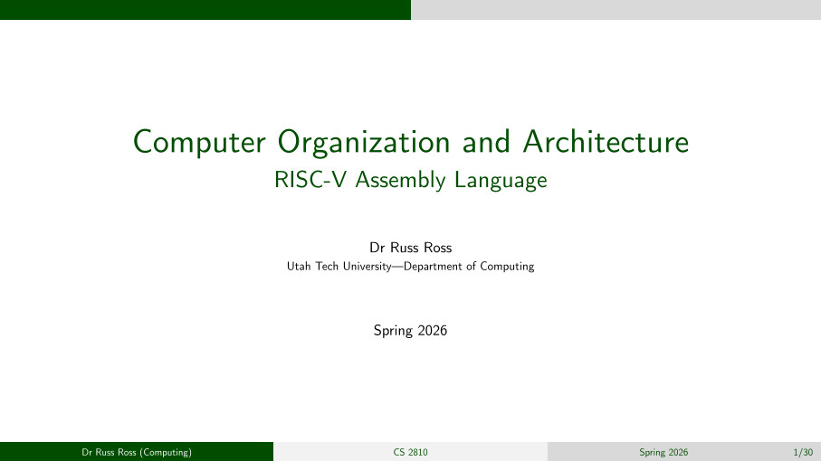
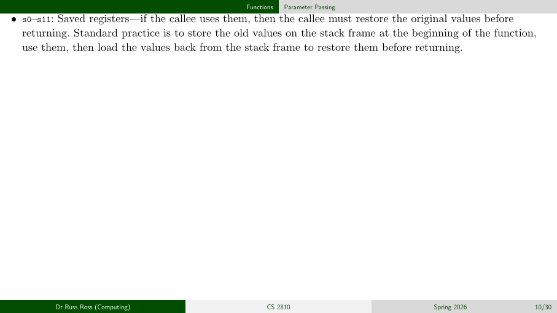

# Greenbar slides

A simple Typst slide template. The page is framed with a green-themed header and
footer (modeled after the Beamer CambridgeUS template) and uses the CMU
(Computer Modern Unicode) family of fonts.






## Getting started

Make sure you have the CMU fonts installed. From Debian-based systems:

    sudo apt install fonts-cmu

Import the template and apply it with `#show`:

```typ
#import "greenbar.typ": *

#show: slides.with(
  title: [Programming Languages],
  short-title: [CS 3520],
  subtitle: [Types],
  author: [Dr Russ Ross],
  institute: [Utah Tech University—Department of Computing],
  short-institute: [Computing],
  date: [Fall 2025],
)
```

Then write your deck using standard Typst headings:

- `=` sets the current **section** (appears in the header bar and PDF bookmarks, I generally use one section per lecture)
- `==` sets the current **topic** (appears in the header bar and PDF bookmarks)
- `===` starts a **new slide** with the given title
- `====` creates a styled **subheading** inside a slide body

```typ
= Introduction to Types

=== Introduction to Types

We will use the term _type_ to refer to a _static_ check.

== A Standard Model of Types

=== A Standard Model of Types

Types are an abstraction of run-time values.
```

If a slide is too long it will spill onto another slide.


## Configuration

All parameters to `slides()` are optional except the body. Common options:

| Parameter          | Default                    | Description                          |
|--------------------|----------------------------|--------------------------------------|
| `title`            | `[Untitled]`               | Title shown on the title slide       |
| `subtitle`         | `none`                     | Line below the title                 |
| `short-title`      | same as `title`            | Compact label for the footer         |
| `author`           | `none`                     | Author line on the title slide       |
| `institute`        | `none`                     | Institute line on the title slide    |
| `short-institute`  | `none`                     | Short institute for the footer       |
| `date`             | `none`                     | Date on title slide and footer       |
| `color`            | `rgb(0, 77, 0)`            | Primary accent color                 |
| `font-size`        | `8pt`                      | Base body size (others derive from it)|
| `aspect-ratio`     | `"16-9"`                   | `"16-9"` or `"4-3"`                 |

Font faces (`text-font`, `heading-font`, `mono-font`, `math-font`) and
fine-grained size overrides (`heading-size`, `mono-size`, `chrome-size`) are
also available as variables.


## Building

Compile a deck with the Typst CLI:

```sh
typst compile types.typ
```

or even better:

```sh
typst watch types.typ
```

which automatically recompiles whenever you save changes.
